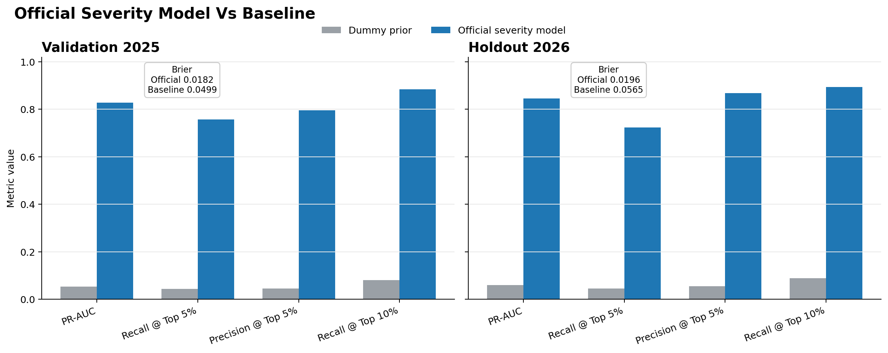
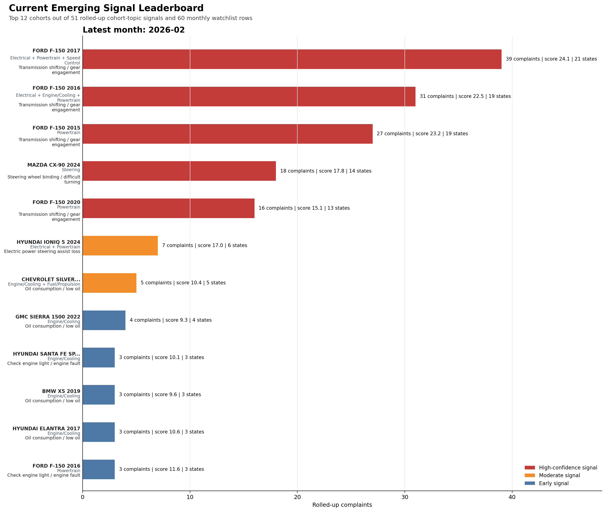

# NHTSA ODI Complaint Analytics

Professional-grade data science repository for analyzing National Highway Traffic Safety Administration (NHTSA) Office of Defects Investigation (ODI) consumer complaint data. The repository is built around a locked final modeling and reporting surface for complaint severity triage, component routing, and NLP early-warning signal monitoring.

[](#how-to-run-the-official-pipelines) [](#data-foundation-and-interpretation) [](#locked-systems) [](#key-outputs-and-figures)

| Dimension | Summary |
| --- | --- |
| Objective | Turn ODI complaint data into reproducible severity triage, component-routing, and NLP early-warning outputs |
| Data Window | 2020-2026 ODI complaint source files with time-aware development, validation, and holdout framing |
| Locked Systems | Severity urgency scoring, component routing, and NLP early-warning watchlists |
| Key Deliverables | Official manifests, benchmark tables, watchlists, recurring-signal summaries, and presentation-ready figures |

## Table of Contents

- [Overview](#overview)
- [Locked Systems](#locked-systems)
- [Generated Benchmark Snapshot](#generated-benchmark-snapshot)
- [Key Outputs And Figures](#key-outputs-and-figures)
- [Data Foundation And Interpretation](#data-foundation-and-interpretation)
- [How To Run The Official Pipelines](#how-to-run-the-official-pipelines)
- [Main Notebooks](#main-notebooks)
- [Repository Structure](#repository-structure)
- [Additional References](#additional-references)

## Overview

This repository packages the ODI complaint workflow as a final end-to-end analytics product, with supporting initial exploratory notebooks. Raw complaint files are ingested, cleaned into task-specific tables, scored through three locked modeling systems, and published as benchmark artifacts, watchlists, and presentation-ready figures.

The final supported surface is designed to answer three practical questions:

- which complaints should move to the front of a limited review queue
- which vehicle component groups are most likely implicated by a complaint
- which complaint-topic cohorts are emerging or recurring strongly enough to monitor over time

The pipeline contract is intentionally simple:

1. ingest complaint source files from `data/raw/`
2. build cleaned and task-specific tables in `data/processed/`
3. run the locked official modeling pipelines
4. publish reporting artifacts in `data/outputs/` and `docs/figures/`

## Locked Systems

### Severity urgency scoring

- Official pipeline: `src/modeling/severity_urgency_model.py`
- Purpose: prioritize complaints for limited review capacity
- Final framing: tuned late-fusion text + structured urgency benchmark on a time-aware split
- Main outputs: official manifest, metrics, review-budget tables, and calibration tables

### Component routing

- Official single-label pipeline: `src/modeling/component_single_text_calibrated.py`
- Official multi-label pipeline: `src/modeling/component_multi_routing.py`
- Purpose: route complaints into likely vehicle component groups
- Final framing:
  - single-label benchmark for scoped complaint routing
  - multi-label benchmark for broader kept-case routing
- Main outputs: official manifests, holdout metrics, class metrics, confusion summaries, and benchmark summary tables

### NLP early-warning watchlists

- Official pipeline: `src/modeling/nlp_early_warning_system.py`
- Purpose: surface emerging and recurring complaint-topic signals over time
- Final framing: lemma-based TF-IDF + NMF with a locked 20-topic library
- Main outputs: topic scan, topic library, watchlist, watchlist summary, risk monitor, recurring large-signal table, clue terms, and watchlist figures

### Reporting layer

- `src/reporting/component_visuals.py`
- `src/reporting/severity_visuals.py`
- `src/reporting/watchlist_visuals.py`
- `src/reporting/update_component_readme.py`

These modules generate the figure sets under `docs/figures/` and refresh the generated benchmark snapshot in this README from the official artifacts in `data/outputs/`.

<!-- COMPONENT_BENCHMARK_START -->
### Generated Benchmark Snapshot

This section is generated from the official severity, component, and NLP early-warning artifacts in `data/outputs/`.
Severity reports the locked primary-target urgency rule on `valid_2025` plus the `2026` reference check.
The published component-model scores come from the untouched `2026` holdout.

#### Severity urgency benchmark

- Scope: official complaint-level severity urgency benchmark
- Target: `severity_primary_flag`
- Baseline: `dummy_prior`
- Model: `late_fusion_sigmoid`
- Text weight: `0.81`
- Validation PR-AUC / Brier: `0.8282` / `0.0182`
- Validation top-5% recall / precision: `0.7565` / `0.7951`
- Holdout PR-AUC / Brier: `0.8452` / `0.0196`
- Holdout top-5% recall / precision: `0.7233` / `0.8682`

#### Single-label component benchmark

- Scope: official single-label component complaint benchmark
- Model: `text_structured_late_fusion`
- Inputs: complaint narrative text + `wave1_incident_cohort_history` structured companion features
- Text weight: `0.75`
- Final text model: `sgd`
- Calibration: `power` alpha `1.5` from `select_2025`
- Structured branch iteration: `1800`
- Holdout macro F1: `0.7466`
- Holdout top-1 accuracy: `0.8522`
- Holdout top-3 accuracy: `0.9481`
- Holdout calibration ECE: `0.0251`
- Release status: `official`

#### Multi-label routing benchmark

- Scope: official multi-label complaint routing benchmark
- Model: `CatBoost MultiLabel`
- Feature set: `core_structured`
- Threshold: `0.2`
- Selected iteration: `1200`
- Holdout macro F1: `0.2285`
- Holdout micro F1: `0.4571`
- Holdout recall@3: `0.6751`
- Holdout precision@3: `0.3027`
- Release status: `official`

#### NLP early-warning snapshot

- Scope: `official lemma-based NLP early-warning pipeline`
- Locked topic count: `20`
- Development window end: `2024-12`
- Forward watchlist window start: `2025-01`
- Latest watchlist month: `2026-02`
- Watchlist rows: `7364`
- Risk monitor rows: `1359`
- Recurring large-signal rows: `3201`

Latest-month signal examples:

- `FORD F-150 2017` | `Transmission shifting / gear engagement issue` | `39` complaints | `High-confidence signal`
- `MAZDA CX-90 2024` | `Steering wheel binding / difficult turning issue` | `18` complaints | `High-confidence signal`
- `HYUNDAI IONIQ 5 2024` | `Electric power steering assist loss` | `7` complaints | `Moderate signal`

<!-- COMPONENT_BENCHMARK_END -->

## Key Outputs And Figures

### Canonical output surface

| System | Primary committed outputs | What they provide |
| --- | --- | --- |
| Severity urgency scoring | `severity_urgency_official_manifest.json`, `severity_urgency_official_metrics.csv`, `severity_urgency_official_review_budgets.csv`, `severity_urgency_official_calibration.csv` | Locked urgency benchmark, calibration evidence, and practical review-budget tradeoffs |
| Component routing | `component_single_label_official_manifest.json`, `component_multilabel_official_manifest.json`, `component_official_benchmark_summary.csv`, `component_official_benchmark_summary.json` | Locked single-label and multi-label routing benchmarks plus a compact reporting summary |
| NLP early-warning | `nlp_early_warning_official_manifest.json`, `nlp_early_warning_topic_library.csv`, `nlp_early_warning_watchlist.csv`, `nlp_early_warning_watchlist_summary.csv`, `nlp_early_warning_risk_monitor.csv`, `nlp_early_warning_recurring_large_signals.csv`, `nlp_early_warning_terms.csv` | Topic monitoring, monthly emerging-signal triage, persistent-risk views, and interpretation support |

### Reporting surface

| Surface | Canonical location | Notes |
| --- | --- | --- |
| Component figures | `docs/figures/component_models/` | Benchmark summary, lift, class-F1, calibration, and confusion visuals |
| Severity figures | `docs/figures/severity_model/` | Baseline-vs-official comparison, review-budget tradeoff, calibration, and split-context visuals |
| NLP figures | `docs/figures/nlp_early_warning/` | Latest watchlist leaderboard, topic mix, topic-share shift, recurring signals, and recent signal flow |
| Generated benchmark summary | `README.md` benchmark block | Refreshed from official severity, component, and NLP artifacts |

The committed figure and CSV surface is the reader-facing reporting layer. Large audit artifacts such as `data/outputs/nlp_early_warning_complaint_topics.parquet` remain generated local outputs and are not committed by default.

### Selected figures

#### Component benchmark summary


This figure is the quickest view of the locked component-routing surface and the relative strength of the single-label and multi-label benchmarks.

#### Severity urgency benchmark



This figure shows the official severity model against the baseline on the locked validation and holdout views, making the review-prioritization lift easy to interpret.

#### NLP early-warning leaderboard



This figure shows the highest-priority current cohort-topic signals in the official NLP watchlist, including size, strength, and geographic spread.

## Data Foundation And Interpretation

### Data sources

- ODI complaints schema reference: `docs/CMPL.txt`
- recalls schema reference: `docs/RCL.txt`
- preferred complaint source filenames:
  - `data/raw/COMPLAINTS_RECEIVED_2020-2024.zip`
  - `data/raw/COMPLAINTS_RECEIVED_2025-2026.zip`

### Important interpretation notes

- ODI complaints are treated as signals, not confirmed defects
- time-aware validation is part of the locked modeling contract
- raw source ZIP files are treated as immutable
- recall linkage is available as a later extension, not as part of the core locked pipeline

## How To Run The Official Pipelines

### Runtime expectations

- Python environment defined by `requirements.txt`
- spaCy English model `en_core_web_sm` is required for the official NLP pipeline
- raw complaint ZIP files should be present in `data/raw/`

### Official execution order

1. run ingest if complaint inputs need to be rebuilt
2. run the official component, severity, or NLP pipeline
3. review `data/outputs/` and `docs/figures/`
4. use notebooks only for review or additional exploration

### Runner scripts

#### Windows

```powershell
.\scripts\run_ingest_windows.ps1
.\scripts\run_component_official_windows.ps1
.\scripts\run_severity_official_windows.ps1
.\scripts\run_nlp_official_windows.ps1
```

#### macOS / Linux

```bash
./scripts/run_ingest_mac_linux.sh
./scripts/run_component_official_mac_linux.sh
./scripts/run_severity_official_mac_linux.sh
./scripts/run_nlp_official_mac_linux.sh
```

### Direct module entrypoints

```powershell
.\.venv\Scripts\python.exe -m src.preprocessing.clean_complaints --output-format parquet
.\.venv\Scripts\python.exe -m src.modeling.component_single_text_calibrated --task-type CPU
.\.venv\Scripts\python.exe -m src.modeling.component_multi_routing --task-type CPU
.\.venv\Scripts\python.exe -m src.modeling.severity_urgency_model
.\.venv\Scripts\python.exe -m src.modeling.nlp_early_warning_system
.\.venv\Scripts\python.exe -m src.reporting.component_visuals
.\.venv\Scripts\python.exe -m src.reporting.severity_visuals
.\.venv\Scripts\python.exe -m src.reporting.watchlist_visuals
.\.venv\Scripts\python.exe -m src.reporting.update_component_readme
```

For the full supported contract, see [src/PIPELINE.md](src/PIPELINE.md).

## Main Notebooks

The notebooks are retained as the project's development and review surfaces. The hardened `src/` pipelines and generated artifacts are the source of truth for the locked outputs.

- `notebooks/EDA.ipynb`: structural audit, missingness review, anomaly checks, and visual EDA
- `notebooks/Cleaning.ipynb`: cleaning logic, issue flags, date handling, and target-construction review
- `notebooks/Component_Modeling.ipynb`: original component benchmark development and diagnosis notebook
- `notebooks/Severity_Ranking_Framework.ipynb`: severity-model development, review-budget analysis, and sensitivity review
- `notebooks/NLP_Early_Warning_Framework.ipynb`: topic-library review, watchlist interpretation, and NLP companion-table inspection

Archived experiment entrypoints remain under `notebooks/archive/` for historical comparison work, but they are not part of the official reporting contract.

## Repository Structure

```text
NHTSA-ODI-COMPLAINT-ANALYTICS/
|-- README.md
|-- requirements.txt
|-- pyproject.toml
|-- .gitignore
|-- .gitattributes
|-- .github/
|-- docs/
|   |-- CMPL.txt
|   |-- RCL.txt
|   `-- figures/
|-- data/
|   |-- raw/
|   |-- extracted/
|   |-- processed/
|   `-- outputs/
|-- scripts/
|   |-- run_ingest_windows.ps1
|   |-- run_ingest_mac_linux.sh
|   |-- run_component_official_windows.ps1
|   |-- run_component_official_mac_linux.sh
|   |-- run_severity_official_windows.ps1
|   |-- run_severity_official_mac_linux.sh
|   |-- run_nlp_official_windows.ps1
|   |-- run_nlp_official_mac_linux.sh
|   `-- check_repo_integrity.py
|-- notebooks/
|   |-- EDA.ipynb
|   |-- Cleaning.ipynb
|   |-- Component_Modeling.ipynb
|   |-- Severity_Ranking_Framework.ipynb
|   |-- NLP_Early_Warning_Framework.ipynb
|   `-- archive/
`-- src/
    |-- config/
    |-- data/
    |-- preprocessing/
    |-- modeling/
    `-- reporting/
```

## Additional References

- live pipeline contract: `src/PIPELINE.md`
- complaint schema reference: `docs/CMPL.txt`
- recall schema reference: `docs/RCL.txt`
