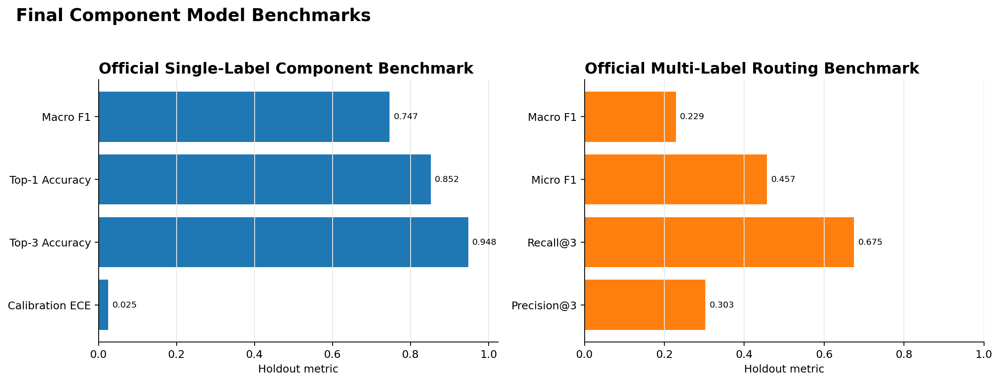
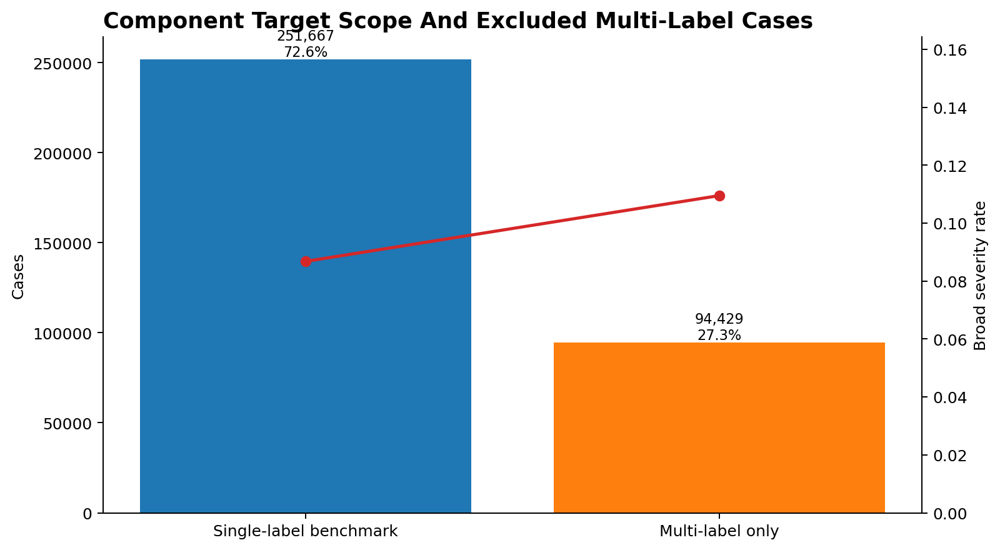
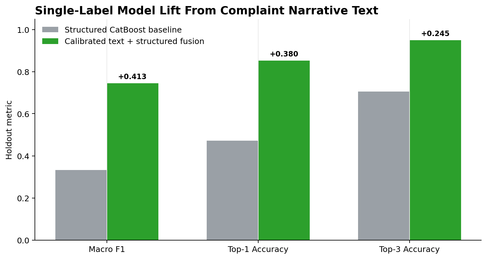
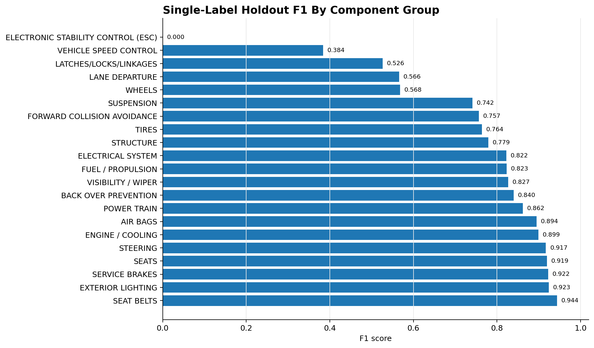
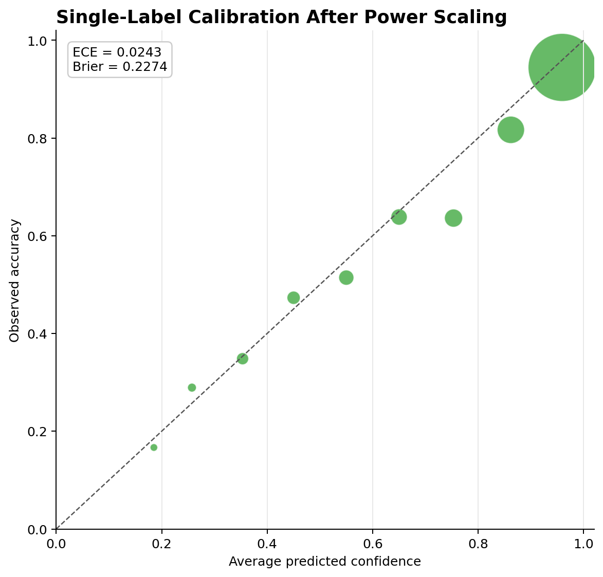
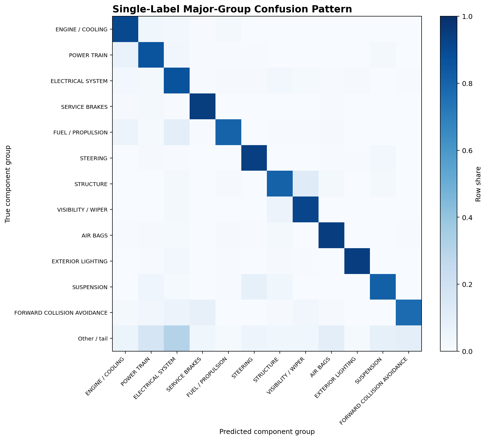
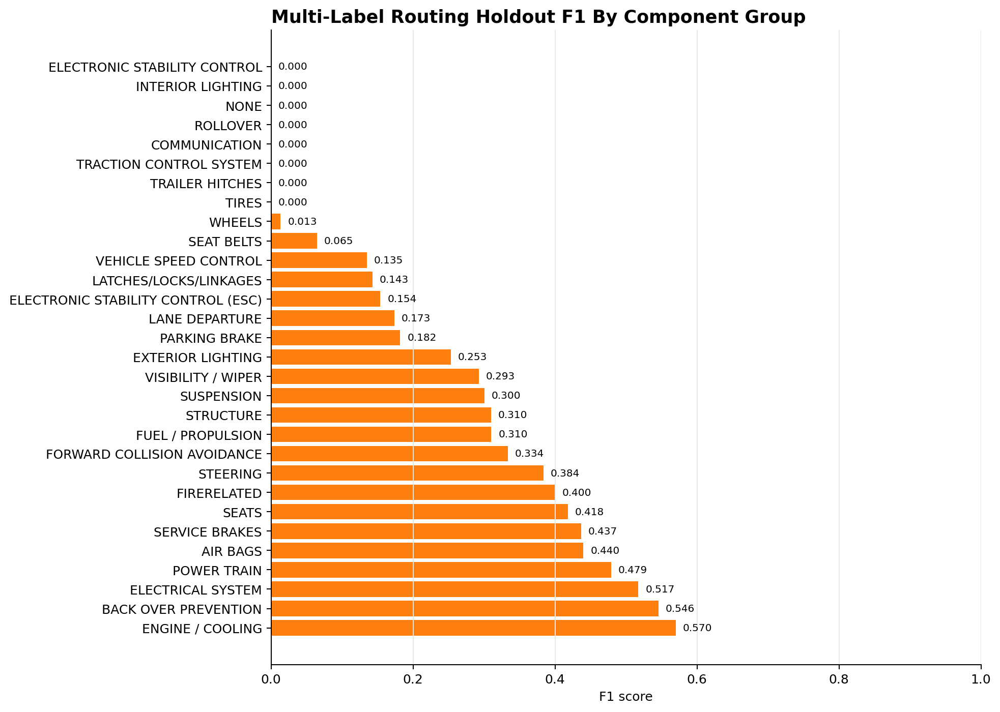

# Component Model Report

Last updated: April 6, 2026

## Executive Summary

The component-model phase is locked with two official models:

- Single-label component benchmark: calibrated Wave 2b `text_structured_late_fusion`
- Multi-label routing benchmark: structured CatBoost MultiLabel on `core_structured`

The models differ by task because the complaint narrative text produced a large and stable gain for the scoped single-label benchmark, while the text-based multi-label model traded too much micro F1 and recall@3 for tail-label macro F1. For the full multi-label routing problem, the structured CatBoost model remains the more useful official benchmark.



## Final Model Decisions

| Task | Official model | Inputs | Final holdout split | Primary metric | Result |
| --- | --- | --- | --- | --- | --- |
| Single-label component classification | `text_structured_late_fusion` | Complaint narrative text + `wave1_incident_cohort_history` structured features | `holdout_2026` | Macro F1 | 0.7454 |
| Multi-label component routing | `CatBoost MultiLabel` | `core_structured` features | `holdout_2026` | Macro F1 with routing metrics | 0.2285 |

Single-label supporting metrics:

| Metric | Structured CatBoost baseline | Final calibrated text fusion |
| --- | ---: | ---: |
| Holdout rows | 6,995 | 6,995 |
| Macro F1 | 0.3319 | 0.7454 |
| Top-1 accuracy | 0.4722 | 0.8523 |
| Top-3 accuracy | 0.7052 | 0.9500 |
| Calibration ECE | 0.0121 | 0.0243 |

Multi-label supporting metrics:

| Metric | Official structured CatBoost MultiLabel |
| --- | ---: |
| Holdout rows | 10,192 |
| Threshold | 0.20 |
| Selected iteration | 1200 |
| Macro F1 | 0.2285 |
| Micro F1 | 0.4571 |
| Recall@3 | 0.6751 |
| Precision@3 | 0.3027 |
| Label coverage | 0.8000 |

## Metric And Model Glossary

Metrics used in the component-model work:

| Metric | What it means | Why it fits this project |
| --- | --- | --- |
| Top-1 accuracy | Share of complaints where the model's highest-ranked component prediction matches the target. | Easy to explain and useful when the model is forced to make one component assignment. |
| Top-3 accuracy | Share of complaints where the true component appears anywhere in the model's top three predictions. | Better matches review and triage workflows where a short candidate list is still useful. |
| Precision | Of the cases assigned to a component, the share that truly belong to that component. | Helps show whether a component prediction is noisy, especially for rare labels. |
| Recall | Of the true cases for a component, the share the model successfully retrieves. | Important for not missing safety-related component patterns. |
| F1 | Harmonic mean of precision and recall. | Balances false positives and false negatives better than accuracy alone. |
| Macro F1 | Average F1 across component groups, giving each group equal weight. | Prevents large classes such as engine or electrical complaints from hiding poor rare-class behavior. |
| Micro F1 | Global F1 computed across all label decisions. | Useful for multi-label routing because it reflects total routing quality across frequent and infrequent labels. |
| Recall@3 | In multi-label routing, the share of true labels recovered inside the top three predicted labels. | Directly matches a triage workflow that can review a short list of candidate component groups. |
| Precision@3 | In multi-label routing, the share of the top three predicted labels that are actually true labels. | Penalizes overbroad routing lists that contain too many irrelevant component groups. |
| Label coverage | Share of component labels receiving at least one positive prediction. | Guards against models that look good by predicting only the head classes and ignoring the tail. |
| ECE | Expected calibration error; the weighted average gap between predicted confidence and observed accuracy across confidence bins. | Needed because component probabilities may be presented as confidence scores, not just rankings. |
| Multiclass Brier score | Mean squared error between predicted probabilities and the one-hot true label. | Complements ECE by measuring full-probability quality rather than only confidence-bin gaps. |

Models and modeling choices used in the component-model work:

| Model or method | What it is | Why it was used |
| --- | --- | --- |
| Most frequent baseline | A naive model that always predicts the most common label or labels. | Establishes the minimum bar any useful component model must beat. |
| Logistic regression | A linear classifier that learns class probabilities from weighted input features. | Used as an interpretable structured baseline; it was not the final single-label model because the structured signal was better captured by CatBoost and the large sparse final text refit was too slow with the `saga` solver. |
| SGD classifier | A linear classifier trained with stochastic gradient descent. | Used for sparse TF-IDF text because it scales well to high-dimensional text matrices and gave bounded runtime where full logistic regression was impractical. |
| TF-IDF | Text representation that weights terms by within-document frequency and downweights terms common across many complaints. | Converts narrative complaint text into model-ready sparse features while preserving domain phrases and character patterns. |
| CatBoost | Gradient-boosted decision trees with strong categorical-feature support. | Used for structured complaint fields because the data contains many categorical fields such as make, model, manufacturer, state, and complaint type. |
| CatBoost MultiLabel | CatBoost configured for multi-label component routing. | Used for the full kept-case routing benchmark because it preserved better holdout micro F1 and recall@3 than the text multi-label model. |
| Late fusion | Combines probabilities from separate text and structured models after each model is trained. | Let the strong text model dominate single-label classification while still retaining structured vehicle/context signal. |
| Power calibration | Raises predicted probabilities to a selected alpha and renormalizes them without changing the ranking. | Fixed the underconfident single-label text-fusion probabilities while preserving the model's excellent top-k ranking behavior. |

## Problem Framing

The component model estimates which vehicle component group is implicated in an ODI complaint. This is useful for summarizing defect patterns, supporting downstream severity or early-warning models, and reducing manual review burden. It should not be interpreted as proof of a confirmed defect.

Two related but different modeling tasks are kept:

- Single-label benchmark: scoped benchmark on complaints that collapse cleanly to one retained component group
- Multi-label routing benchmark: full kept-case routing setup where a complaint can map to more than one component group

The single-label task is a cleaner classification benchmark. The multi-label task better reflects the real complaint-routing problem.



## Data And Target Scope

The component target universe is built from processed ODI complaints and cleaned component group labels.

Target scope:

| Segment | Cases | Share | Broad severity rate |
| --- | ---: | ---: | ---: |
| Kept component cases | 346,590 | 100.00% | 9.33% |
| Multi-label benchmark cases | 346,590 | 100.00% | 9.33% |
| Single-label benchmark cases | 251,667 | 72.61% | 8.68% |
| Multi-label-only cases | 94,429 | 27.25% | 10.95% |

This matters because the single-label benchmark is not the full routing problem. Multi-label-only complaints are systematically different and have a higher broad-severity rate, so they are preserved in the multi-label routing benchmark rather than discarded from the project.

## Split Strategy

The final component benchmarks use time-aware splits:

- Training/model development data: complaints through 2025, depending on the modeling stage
- `valid_2025` / `select_2025`: model and calibration selection only
- `holdout_2026`: final benchmark reporting only

Feature-wave work also used a development-only staging policy:

- `train_core`: complaints through 2023
- `screen_2024`: feature-family screening
- `select_2025`: feature-family confirmation and calibration selection
- `holdout_2026`: final benchmark only after a candidate was frozen

This split design prevents post-2025 complaints from influencing model selection, feature selection, calibration selection, or threshold selection before final holdout scoring.

## Leakage And Data Quality Controls

The cleaned pipeline uses `docs/CMPL.txt` as the schema source of truth and keeps the cleanup rules auditable.

Important controls added before locking the models:

- retained `source_file` and `source_zip` provenance in processed tables
- added `source_era` for pre/post-2021 schema behavior
- added `miles_zero_flag` and `veh_speed_zero_flag`
- treated ambiguous `miles == 0` and `veh_speed == 0` as missing for modeling while retaining the zero flags
- generated source-era drift summaries
- moved rare-class filtering to the final modeling unit
- added a multi-label component case table instead of treating single-label collapse as the whole task
- generated a complaint text sidecar keyed by `odino`

Exact complaint-narrative overlap was checked across temporal boundaries:

| Boundary | Later split row overlap |
| --- | ---: |
| `train_core -> screen_2024` | 1.1770% |
| `dev_2020_2024 -> select_2025` | 1.0348% |
| `dev_2020_2025 -> holdout_2026` | 0.7071% |

The overlap was low and was monitored as a sensitivity diagnostic rather than used as a default exclusion rule.

## Single-Label Model

The final single-label component model is a calibrated late fusion of:

- a sparse-text SGD model trained on complaint narrative text
- a structured CatBoost model using `wave1_incident_cohort_history`

Final configuration:

- family: `text_structured_late_fusion`
- text branch: SGD sparse text model
- structured branch: CatBoost
- structured feature set: `wave1_incident_cohort_history`
- text weight: 0.75
- structured selected iteration: 1280
- calibration method: power calibration
- calibration alpha: 1.5
- calibration source: `select_2025`

The text model uses classical sparse NLP features:

- word TF-IDF with 1-2 grams
- character word-boundary TF-IDF with 3-5 grams
- no stemming
- no lemmatization
- no stop-word removal

The final single-label model was chosen because it sharply improved holdout macro F1, top-1 accuracy, and top-3 accuracy while staying within the calibration promotion gate after Wave 2b calibration.









## Multi-Label Model

The final multi-label routing model remains the structured CatBoost MultiLabel benchmark.

Final configuration:

- model: `CatBoost MultiLabel`
- feature set: `core_structured`
- threshold: 0.20
- selected iteration: 1200
- holdout split: `holdout_2026`

The text-based multi-label model was evaluated but not promoted. It improved holdout macro F1 by predicting rare labels more aggressively, but it reduced micro F1, recall@3, and precision@3. Those tradeoffs are not acceptable for the routing use case, where preserving broad routing recall is more important than improving rare-label macro F1 alone.



## Calibration

The uncalibrated single-label text fusion model was highly accurate but underconfident. Wave 2b applied ranking-preserving power calibration using `select_2025`.

Calibration result:

| Metric | Value |
| --- | ---: |
| Calibration method | Power |
| Alpha | 1.5 |
| Calibration source | `select_2025` |
| Holdout accuracy | 0.8523 |
| Average confidence | 0.8747 |
| Confidence gap | 0.0224 |
| ECE | 0.0243 |
| Multiclass Brier score | 0.227377 |

The final model is slightly overconfident overall, but the ECE remains inside the predefined promotion gate: baseline ECE 0.0121 plus allowed worsening 0.0200 gives a maximum acceptable ECE of 0.0321.

## Known Limitations

- The single-label model applies to the scoped single-label benchmark subset, not to every kept component complaint.
- The multi-label routing model is weaker on rare labels and should be used as a benchmark/routing aid rather than a high-confidence rare-label classifier.
- Complaints are consumer-reported signals and are not confirmed defects.
- Component predictions should not be used as causal evidence about manufacturer responsibility, recall need, or defect existence.
- Text features can learn domain language and complaint descriptions well, but they may also pick up reporting-style differences across time or source-era changes.
- The final component models were tuned for component classification/routing, not severity ranking or early-warning detection.

## Reproducibility Artifacts

Primary artifacts:

- `data/outputs/component_official_benchmark_summary.csv`
- `data/outputs/component_official_benchmark_summary.json`
- `data/outputs/component_textwave2b_calibration_manifest.json`
- `data/outputs/component_single_label_textwave2b_calibrated_holdout.csv`
- `data/outputs/component_single_label_textwave2b_calibration.csv`
- `data/outputs/component_multilabel_manifest.json`
- `data/outputs/component_multilabel_metrics.csv`
- `data/outputs/component_multilabel_label_metrics.csv`
- `docs/figures/component_models/component_model_figure_index.csv`

Regenerate the README benchmark block and official summary artifacts:

```powershell
.\.venv\Scripts\python.exe -m src.reporting.update_component_readme
```

Regenerate the presentation figures:

```powershell
.\.venv\Scripts\python.exe -m src.reporting.component_visuals
```

## Next Use

The component model phase is complete. For the next project phase, the locked component outputs can be used as supporting features or diagnostics for severity ranking and early-warning signal modeling. They should be treated as component-pattern signals, not as ground-truth defect labels.
